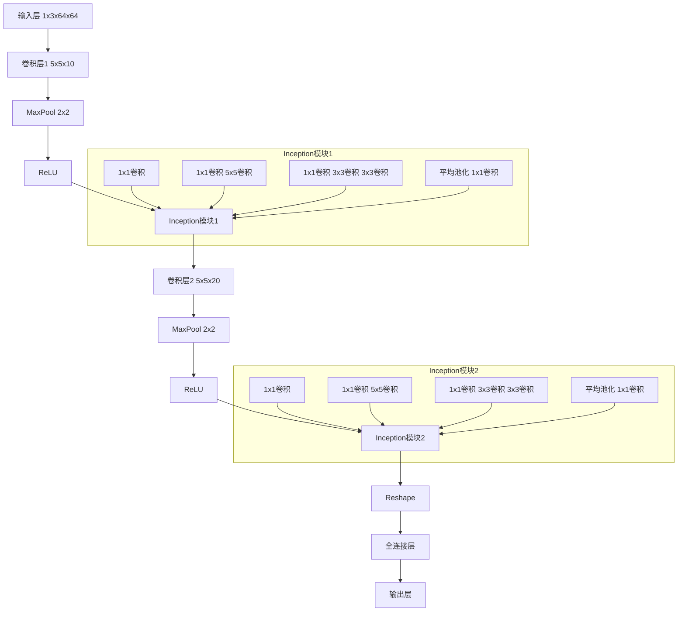
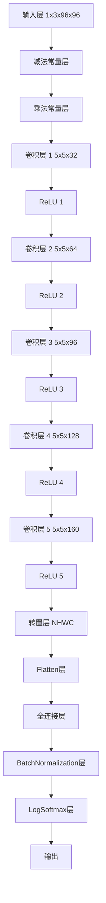

# AahAI

## 模型描述

- **deploy_direction_cls.onnx**：用于识别战斗干员的方向（四分类模型）。
- **operators_det.onnx**：用于检测战斗干员。
- **skill_ready_cls.onnx**：用于识别战斗技能是否准备好（二分类模型）。
- **ocr模型**:调用paddlepaddle包预测。

## 模型基本信息

### Model: resources/models/skill_ready_cls.onnx

输入名称: input
`输入形状: [1, 3, 64, 64]`
输入类型: tensor(float)

原始图像形状: (64, 64, 3)
调整后输入图像的形状: (1, 3, 64, 64)
模型的输出: [array([[-3757.0815,  3828.271 ]], dtype=float32)]
预测类别索引: 1




### Model: resources/models/deploy_direction_cls.onnx

输入名称: input
`输入形状: [1, 3, 96, 96]`
输入类型: tensor(float)

原始图像形状: (96, 96, 3)
调整后输入图像的形状: (1, 3, 96, 96)
模型的输出: [array([[-303.65408, -643.6919 , -568.03253,    0.     ]], dtype=float32)]
预测干员方向类别索引: 3




###Model: resources/models/operators_det.onnx

Model inputs:
Name: images
Type: FLOAT
`Shape: [1, 3, 640, 640]`
Model outputs:
Name: output0
Type: FLOAT
`Shape: [1, 5, 8400]`


```
use std::io::Cursor;
use image::DynamicImage;
use tract_onnx::prelude::*;

#[derive(Debug)]
pub struct Detection {
    pub x: f32,
    pub y: f32,
    pub w: f32,
    pub h: f32,
    pub score: f32,
}


// 嵌入模型文件
const SKILL_READY_CLS_MODEL: &[u8] = include_bytes!("../resources/models/skill_ready_cls.onnx");
const DEPLOY_DIRECTION_CLS_MODEL: &[u8] = include_bytes!("../resources/models/deploy_direction_cls.onnx");
const OPERATORS_DET_MODEL: &[u8] = include_bytes!("../resources/models/operators_det.onnx");

/// 将图像转换为模型输入的张量
fn image_to_tensor(image: &DynamicImage, size: u32) -> Tensor {
    // draw_box(image, x, y, width, height, rgba_u8)
    let resized_img = image::imageops::resize(image, size, size, image::imageops::FilterType::Triangle);
    let input: Tensor = tract_ndarray::Array4::from_shape_fn((1, 3, size as usize, size as usize), |(_, c, h, w)| {
        resized_img[(w as u32, h as u32)][c] as f32 / 255.0
    }).into();
    input
}

/// 加载ONNX模型并进行推理（通用）
fn run_onnx_model_generic(model_bytes: &[u8], image_path: &str, input_size: u32) -> TractResult<usize> {
    // 加载ONNX模型
    let mut cursor = Cursor::new(model_bytes);
    let model = tract_onnx::onnx().model_for_read(&mut cursor)?;

    // 设置输入形状
    let input_shape: [usize; 4] = [1, 3, input_size as usize, input_size as usize];
    let model = model.with_input_fact(0, InferenceFact::dt_shape(f32::datum_type(), input_shape))?;
    let model = model.into_optimized()?.into_runnable()?;

    // 读取并预处理输入图像
    let img = image::open(image_path)?.to_rgb8();
    let img = DynamicImage::ImageRgb8(img);  // 将 ImageBuffer 转换为 DynamicImage
    let input_data = image_to_tensor(&img, input_size);

    // 运行模型进行推理
    let result = model.run(tvec!(input_data.into()))?;
    let output = result[0].to_array_view::<f32>()?;
    
    // 获取预测结果
    let predicted_class = output.iter().enumerate().max_by(|a, b| a.1.partial_cmp(b.1).unwrap()).map(|(idx, _)| idx).unwrap_or(0);

    Ok(predicted_class)
}

/// 加载ONNX模型并进行推理（二分类模型）
pub fn run_onnx_model_two_class(image_path: &str) -> TractResult<usize> {
    run_onnx_model_generic(SKILL_READY_CLS_MODEL, image_path, 64)
}

/// 加载ONNX模型并进行推理（四分类模型）
pub fn run_onnx_model_four_class(image_path: &str) -> TractResult<usize> {
    run_onnx_model_generic(DEPLOY_DIRECTION_CLS_MODEL, image_path, 96)
}

/// 加载ONNX模型并进行目标检测（YOLOv8 模型）
pub fn run_yolov8_model(image_path: &str) -> TractResult<Vec<Detection>> {
    // 加载ONNX模型
    let mut cursor = Cursor::new(OPERATORS_DET_MODEL);
    let model = tract_onnx::onnx().model_for_read(&mut cursor)?;

    // 设置输入形状
    let input_shape: [usize; 4] = [1, 3, 640, 640];
    let model = model.with_input_fact(0, InferenceFact::dt_shape(f32::datum_type(), input_shape))?;
    let model = model.into_optimized()?.into_runnable()?;

    // 读取并预处理输入图像
    let img = image::open(image_path)?.to_rgb8();
    let img = DynamicImage::ImageRgb8(img);  // 将 ImageBuffer 转换为 DynamicImage
    let input_data = image_to_tensor(&img, 640);

    // 运行模型进行推理
    let result = model.run(tvec!(input_data.into()))?;
    let output = result[0].to_array_view::<f32>()?;

    // 解析模型输出
    let mut results = Vec::new();
    let output_shape = output.shape();
    for i in 0..output_shape[1] {
        let score = output[[0, i, 4]];
        if score > 0.3  {  // 过滤置信度较低和不合理的检测框
            // 获取检测框的中心坐标和尺寸
            let center_x = output[[0, i, 0]] * img.width() as f32 / 640.0;  // 中心x坐标
            let center_y = output[[0, i, 1]] * img.height() as f32 / 640.0;  // 中心y坐标
            let w = output[[0, i, 2]] * img.width() as f32 / 640.0;  // 宽度
            let h = output[[0, i, 3]] * img.height() as f32 / 640.0;  // 高度

            // 将中心坐标转换为左上角坐标
            let x = center_x - w / 2.0;  // 左上角x坐标
            let y = center_y - h / 2.0;  // 左上角y坐标

            // 存储检测结果
            results.push(Detection { x, y, w, h, score });
        }
    }

    Ok(results)
}

#[cfg(test)]
mod tests {
    

    use super::*;

    #[test]
    fn test_run_onnx_model_two_class() {
        
        let image_path = "resources/input/skill_ready/unready/unready1.png";
        match run_onnx_model_two_class(image_path) {
            Ok(predicted_class) => println!("预测二分类模型类别索引: {}", predicted_class),
            Err(e) => eprintln!("运行二分类模型时出错: {:?}", e),
        }
    }

    #[test]
    fn test_run_onnx_model_four_class() {
        let screen_cap_cnt = 2;
        let tests = [("right", 4), ("down", 0), ("left", 3), ("up", 1)];
        for i in 0..screen_cap_cnt {
            for (_class, &(dir, cnt)) in tests.iter().enumerate() {
                for j in 0..cnt {
                    let image_path = format!("resources/input/direction/LS-6_{i}_{dir}{j}.png");
                    match run_onnx_model_four_class( &image_path) {
                        Ok(predicted_class) => {
                            println!("预测四分类模型类别索引: {}", predicted_class);
                            // assert_eq!(i, predicted_class);
                        }
                        Err(e) => eprintln!("运行四分类模型时出错: {:?}", e),
                    }
                }
            }
        }
    }

    #[test]
    fn test_run_yolov8_model() {
      
        let image_path = "resources/input/operators_det/2.png";
        match run_yolov8_model( image_path) {
            Ok(detections) => {
                for detection in detections {
                    println!(
                        "检测到的目标: 位置 ({}, {}), 宽度 {}, 高度 {}, 置信度 {:.2}",
                        detection.x, detection.y, detection.w, detection.h, detection.score
                    );
                }
            }
            Err(e) => eprintln!("运行模型时出错: {:?}", e),
        }
    }


}

```

```
use regex::Regex;
use std::process::Command;
use std::path::Path;
use encoding::{Encoding, DecoderTrap};
use encoding::all::GBK;

#[derive(Debug)]
pub struct OcrResult {
    pub bbox: Vec<[f64; 2]>,
    pub text: String,
    pub confidence: f64,
}

pub fn ocr(image_path: &str) -> Result<Vec<OcrResult>, Box<dyn std::error::Error>> {
    // Check if the image file exists
    if !Path::new(image_path).exists() {
        return Err(format!("Image file not found: {}", image_path).into());
    }

    // Construct the command
    let output = Command::new("paddleocr")
        .arg("--image_dir")
        .arg(image_path)
        .arg("--use_angle_cls")
        .arg("true")
        .arg("--use_gpu")
        .arg("false")
        .output()?;

    if !output.status.success() {
        return Err(format!("Failed to execute PaddleOCR: {}", String::from_utf8_lossy(&output.stderr)).into());
    }

    // Convert output to string, handle possible GBK encoding
    let stdout_gbk = GBK.decode(&output.stdout, DecoderTrap::Replace)?;
    let stdout = String::from_utf8_lossy(stdout_gbk.as_bytes()).to_string();

    // Define the regex pattern to match OCR results
    let re = Regex::new(r": \[\[\[(.*?), (.*?)\], \[(.*?), (.*?)\], \[(.*?), (.*?)\], \[(.*?), (.*?)\]\], \('(.*)', (.*)\)\]").unwrap();
    let mut results = Vec::new();

    // Parse the OCR results
    for cap in re.captures_iter(&stdout) {
        let bbox = vec![
            [cap[1].parse::<f64>()?, cap[2].parse::<f64>()?],
            [cap[3].parse::<f64>()?, cap[4].parse::<f64>()?],
            [cap[5].parse::<f64>()?, cap[6].parse::<f64>()?],
            [cap[7].parse::<f64>()?, cap[8].parse::<f64>()?],
        ];
        let text = cap[9].to_string();
        let confidence = cap[10].parse::<f64>()?;

        results.push(OcrResult { bbox, text, confidence });
    }

    Ok(results)
}

#[cfg(test)]
mod tests {
    use super::*;

    #[test]
    fn test_ocr() {
        let image_path = "resources/input/ocr/11.jpg";
        match ocr(image_path) {
            Ok(results) => {
                for result in results {
                    println!("{:#?}", result);
                }
            }
            Err(e) => eprintln!("Error: {}", e),
        }
    }
}

```

```
#[cfg(test)]
mod test {
    use rten::{
        ops::{non_max_suppression, BoxOrder},
        Dimension, FloatOperators, Model, TensorPool,
    };
    use rten_imageio::read_image;
    use rten_imageproc::{Painter, Rect};
    use rten_tensor::{prelude::*, NdTensor, Storage};
    use std::{error::Error, fs};
    use rten_imageio::write_image;

    #[test]
    fn foo() -> Result<(), Box<dyn Error>> {
        let model = Model::load_file("./resources/models/operators_det.rten")?;

        let image = read_image("./resources/input/operators_det/1.png")?;
        let labels: Vec<_> = fs::read_to_string("./resources/models/arknights.names")?
            .lines()
            .map(|s| s.to_string())
            .collect();
        

        // Save a copy of the input before normalization and scaling
        let mut annotated_image = Some(image.clone());

        let [_, image_height, image_width] = image.shape();

        let mut image = image.as_dyn().to_tensor();
        image.insert_axis(0); // Add batch dim

        let input_shape = model
            .input_shape(0)
            .ok_or("model does not specify expected input shape")?;
        let (input_h, input_w) = match &input_shape[..] {
            &[_, _, Dimension::Fixed(h), Dimension::Fixed(w)] => (h, w),

            // If dimensions are not fixed, use the defaults from when this
            // example was created.
            _ => (640, 640),
        };
        let image = image.resize_image([input_h, input_w])?;

        let input_id = model.node_id("images")?;
        let output_id = model.node_id("output0")?;

        let [output] = model.run_n(
            vec![(input_id, image.view().into())].as_slice(),
            [output_id],
            None,
        )?;

        // Output format is [N, 84, B] where `B` is the number of boxes. The second
        // dimension contains `[x, y, w, h, class_0 ... class 79]` where `(x, y)`
        // are the coordinates of the box center, `(h, w)` are the box size and
        // the `class_{i}` fields are class probabilities.
        let output: NdTensor<f32, 3> = output.try_into()?;
        let [_batch, box_attrs, _n_boxes] = output.shape();
        println!("{:?}", box_attrs);
        // assert!(box_attrs == 84);

        let model_in_h = image.size(2);
        let model_in_w = image.size(3);
        let scale_y = image_height as f32 / model_in_h as f32;
        let scale_x = image_width as f32 / model_in_w as f32;

        // [batch, n_boxes, coord]
        let boxes = output.slice::<3, _>((.., ..4, ..)).permuted([0, 2, 1]);

        // [batch, n_classes, n_boxes]. The `n_boxes` coord is last because that
        // is what `non_max_suppression` requires.
        let scores = output.slice::<3, _>((.., 4.., ..));

        let iou_threshold = 0.3;
        let score_threshold = 0.25;

        // nms_boxes is [n_selected, 3];
        let nms_boxes = non_max_suppression(
            &TensorPool::new(),
            boxes.view(),
            scores,
            BoxOrder::CenterWidthHeight,
            None, /* max_output_boxes_per_class */
            iou_threshold,
            score_threshold,
        )?;
        let [n_selected_boxes, _] = nms_boxes.shape();

        let mut painter = annotated_image
            .as_mut()
            .map(|img| Painter::new(img.view_mut()));
        let stroke_width = 2;

        if let Some(painter) = painter.as_mut() {
            painter.set_stroke([1., 0., 0.]);
            painter.set_stroke_width(stroke_width);
        }

        println!("Found {n_selected_boxes} objects in image.");

        for b in 0..n_selected_boxes {
            let [batch_idx, cls, box_idx] = nms_boxes.slice(b).to_array();
            let [cx, cy, box_w, box_h] = boxes.slice([batch_idx, box_idx]).to_array();
            let score = scores[[batch_idx as usize, cls as usize, box_idx as usize]];

            let rect = Rect::from_tlhw(
                (cy - 0.5 * box_h) * scale_y,
                (cx - 0.5 * box_w) * scale_x,
                box_h * scale_y as f32,
                box_w * scale_x as f32,
            );

            let int_rect = rect.integral_bounding_rect().clamp(Rect::from_tlhw(
                stroke_width as i32,
                stroke_width as i32,
                image_height as i32 - 2 * stroke_width as i32,
                image_width as i32 - 2 * stroke_width as i32,
            ));

            if let Some(painter) = painter.as_mut() {
                painter.draw_polygon(&int_rect.corners());
            }

            let label = unsafe {
                labels
                    .get(cls as usize)
                    .map(|s| s.as_str())
                    .unwrap_or("unknown")
            };

            // if !args.summary {
            println!(
            "object: {label} score: {score:.3} left: {} top: {} right: {} bottom: {} box index: {box_idx}",
            int_rect.left(),
            int_rect.top(),
            int_rect.right(),
            int_rect.bottom()
        );
            // }
        }

        if let (Some(annotated_image), Some(path)) = (annotated_image, Some("./output.png")) {
            write_image(&path, annotated_image.view())?;
        }
        Ok(())
    }
}

```

```
//! 模型列表：
//! - [`get_skill_ready`]: 模型名 `skill_ready_cls.onnx`
//! - [`get_direction`]: 模型名 `deploy_direction_cls.onnx`
//! - [`ocr`]: 掉包!!!
//! - [`get_blood`]: 模型名 `operators_det.rten`
use encoding::all::GBK;
use encoding::{DecoderTrap, Encoding};
use image::{open, DynamicImage};
use regex::Regex;
use std::io::Cursor;
use std::path::{Path, PathBuf};
use std::process::Command;
use tract_onnx::prelude::*;
use uuid::Uuid;
use std::{error::Error, fs};
use rten::{
    ops::{non_max_suppression, BoxOrder},
    Dimension, FloatOperators, Model, TensorPool,
};
use rten_imageio::{read_image};
use rten_imageproc::{Painter, Rect};
use rten_tensor::{prelude::*, NdTensor, Storage};


const OPERATORS_DET_MODEL1: &[u8] = include_bytes!("../assets/operators_det.rten");

#[derive(Debug)]
pub struct BloodDetection {
    pub label: String,
    pub score: f32,
    pub bbox: [f32; 4], // [cx, cy, width, height]
}

#[derive(Debug)]
pub struct OcrResult {
    pub bbox: Vec<[f64; 2]>,
    pub text: String,
    pub confidence: f64,
}

/// 获取模型路径
fn get_model_path<P: AsRef<Path>>(res_dir: P, model_filename: &str) -> PathBuf {
    let res_dir = res_dir.as_ref();
    res_dir.join("models").join(model_filename)
}

/// 将图像转换为模型输入的张量,用户模型输入
fn image_to_tensor(image: &DynamicImage, size: u32) -> Tensor {
    let resized_img =
        image::imageops::resize(image, size, size, image::imageops::FilterType::Triangle);
    let input: Tensor = tract_ndarray::Array4::from_shape_fn(
        (1, 3, size as usize, size as usize),
        |(_, c, h, w)| resized_img[(w as u32, h as u32)][c] as f32 / 255.0,
    )
    .into();
    input
}

/// 调用onnx模型进行预测
fn run_onnx_model<P: AsRef<Path>>(model_path: P, image: &DynamicImage, input_size: u32) -> TractResult<usize> {
    // 加载ONNX模型
    let model = tract_onnx::onnx().model_for_path(model_path)?;

    // 设置输入形状
    let input_shape: [usize; 4] = [1, 3, input_size as usize, input_size as usize];
    let model =
        model.with_input_fact(0, InferenceFact::dt_shape(f32::datum_type(), input_shape))?;
    let model = model.into_optimized()?.into_runnable()?;

    // 将图像转换为模型输入的张量
    let input_data = image_to_tensor(&image, input_size);

    // 运行模型进行推理
    
    let result = model.run(tvec!(input_data.into()))?;
    let output = result[0].to_array_view::<f32>()?;
    

    // 获取预测结果
    let predicted_class = output
        .iter()
        .enumerate()
        .max_by(|a, b| a.1.partial_cmp(b.1).unwrap())
        .map(|(idx, _)| idx)
        .unwrap_or(0);
    Ok(predicted_class)
}

/// 技能技能
pub fn get_skill_ready<P: AsRef<Path>>(image: &DynamicImage, res_dir: P) -> TractResult<usize> {
    let model_path = get_model_path(res_dir, "skill_ready_cls.onnx");
    
    run_onnx_model(model_path, image, 64)
}

/// 检测方位
pub fn get_direction<P: AsRef<Path>>(image: &DynamicImage, res_dir: P) -> TractResult<usize> {
    let model_path = get_model_path(res_dir, "deploy_direction_cls.onnx");
    run_onnx_model(model_path, image, 96)
}

/// ocr预测
pub fn ocr(image: &DynamicImage) -> Result<Vec<OcrResult>, Box<dyn std::error::Error>> {
    // 生成一个唯一的文件名
    let image_path = format!("{}.png", Uuid::new_v4());

    // 将DynamicImage保存到文件
    image.save(&image_path)?;

    // 构建命令
    let output = Command::new("paddleocr")
        .arg("--image_dir")
        .arg(&image_path)
        .arg("--use_angle_cls")
        .arg("true")
        .arg("--use_gpu")
        .arg("false")
        .output()?;

    // 删除临时文件
    std::fs::remove_file(image_path)?;

    if !output.status.success() {
        return Err(format!(
            "Failed to execute PaddleOCR: {}",
            String::from_utf8_lossy(&output.stderr)
        )
        .into());
    }

    // 将输出转换为字符串，处理可能的GBK编码
    let stdout_gbk = GBK.decode(&output.stdout, DecoderTrap::Replace)?;
    let stdout = String::from_utf8_lossy(stdout_gbk.as_bytes()).to_string();

    // 定义正则表达式模式来匹配OCR结果
    let re = Regex::new(r": \[\[\[(.*?), (.*?)\], \[(.*?), (.*?)\], \[(.*?), (.*?)\], \[(.*?), (.*?)\]\], \('(.*)', (.*)\)\]").unwrap();
    let mut results = Vec::new();

    // 解析OCR结果
    for cap in re.captures_iter(&stdout) {
        let bbox = vec![
            [cap[1].parse::<f64>()?, cap[2].parse::<f64>()?],
            [cap[3].parse::<f64>()?, cap[4].parse::<f64>()?],
            [cap[5].parse::<f64>()?, cap[6].parse::<f64>()?],
            [cap[7].parse::<f64>()?, cap[8].parse::<f64>()?],
        ];
        let text = cap[9].to_string();
        let confidence = cap[10].parse::<f64>()?;

        results.push(OcrResult {
            bbox,
            text,
            confidence,
        });
    }

    Ok(results)
}

/// get_blood
pub fn get_blood(image: &DynamicImage) -> Result<Vec<BloodDetection>, Box<dyn Error>> {
    // 生成一个唯一的文件名
    let image_path = format!("{}.png", Uuid::new_v4());

    // 将DynamicImage保存到文件
    image.save(&image_path)?;

    // 加载目标检测模型
    let model = Model::load_file("./model/resources/models/operators_det.rten")?;

    // 读取图像
    let image = read_image(&image_path)?;

    // 定义标签内容
    let labels = vec!["blood".to_string()];

    // 获取图像高度和宽度
    let [_, image_height, image_width] = image.shape();

    // 准备输入张量
    let mut image = image.as_dyn().to_tensor();
    image.insert_axis(0); // 增加批量维度

    // 获取模型输入形状
    let input_shape = model
        .input_shape(0)
        .ok_or("model does not specify expected input shape")?;
    let (input_h, input_w) = match &input_shape[..] {
        &[_, _, Dimension::Fixed(h), Dimension::Fixed(w)] => (h, w),
        _ => (640, 640), // 如果维度未固定，使用默认值
    };
    let image = image.resize_image([input_h, input_w])?;

    // 获取模型输入和输出节点ID
    let input_id = model.node_id("images")?;
    let output_id = model.node_id("output0")?;

    // 运行模型并获取输出
    let [output] = model.run_n(
        vec![(input_id, image.view().into())].as_slice(),
        [output_id],
        None,
    )?;

    // 处理模型输出
    let output: NdTensor<f32, 3> = output.try_into()?;
    let [_batch, box_attrs, _n_boxes] = output.shape();
    println!("{:?}", box_attrs);

    let model_in_h = image.size(2);
    let model_in_w = image.size(3);
    let scale_y = image_height as f32 / model_in_h as f32;
    let scale_x = image_width as f32 / model_in_w as f32;

    // 提取边框和分数
    let boxes = output.slice::<3, _>((.., ..4, ..)).permuted([0, 2, 1]);
    let scores = output.slice::<3, _>((.., 4.., ..));

    let iou_threshold = 0.3;
    let score_threshold = 0.25;

    // 非极大值抑制
    let nms_boxes = non_max_suppression(
        &TensorPool::new(),
        boxes.view(),
        scores,
        BoxOrder::CenterWidthHeight,
        None, /* max_output_boxes_per_class */
        iou_threshold,
        score_threshold,
    )?;
    let [n_selected_boxes, _] = nms_boxes.shape();

    println!("Found {n_selected_boxes} objects in image.");

    // 收集检测结果
    let mut detections = Vec::new();

    for b in 0..n_selected_boxes {
        let [batch_idx, cls, box_idx] = nms_boxes.slice(b).to_array();
        let [cx, cy, box_w, box_h] = boxes.slice([batch_idx, box_idx]).to_array();
        let score = scores[[batch_idx as usize, cls as usize, box_idx as usize]];

        let label = unsafe {
            labels
                .get(cls as usize)
                .map(|s| s.as_str())
                .unwrap_or("unknown")
        };

        detections.push(BloodDetection {
            label: label.to_string(),
            score,
            bbox: [cx, cy, box_w, box_h],
        });

    }

    // 删除临时文件
    std::fs::remove_file(image_path)?;

    Ok(detections)
}


#[cfg(test)]
mod tests {
    const res_dir: &str = "../azur-arknights-helper/resources";
    // use std::time::Instant;
    use super::*;
    use image::open;

    #[test] //测试技能
    fn test_get_skill_ready() {
        // let image_path = "resources/input/skill_ready/ready/ready1.png";
        // println!("加载图片: {}", image_path);

        // match open(image_path) {
        //     Ok(img) => {
        //         let img = img.to_rgb8();
        //         let img = DynamicImage::ImageRgb8(img);
        //         match get_skill_ready(&img) {
        //             Ok(predicted_class) => println!("预测二分类模型类别索引: {}", predicted_class),
        //             Err(e) => eprintln!("运行二分类模型时出错: {:?}", e),
        //         }
        //     }
        //     Err(e) => eprintln!("无法加载图片: {}", e),
        // }
    }

    #[test] //测试方位 "right" "down" "left" "up" -> 0 1 2 3
    fn test_get_direction() {
        // let image_path = "resources/input/direction/down1.png";
        // println!("加载图片: {}", image_path);

        // match open(image_path) {
        //     Ok(img) => {
        //         let img = img.to_rgb8();
        //         let img = DynamicImage::ImageRgb8(img);
        //         match get_direction(&img) {
        //             Ok(predicted_class) => println!("预测四分类模型类别索引: {}", predicted_class),
        //             Err(e) => eprintln!("运行四分类模型时出错: {:?}", e),
        //         }
        //     }
        //     Err(e) => eprintln!("无法加载图片: {}", e),
        // }
    }

    #[test] //测试ocr
    fn test_ocr() {
        let image_path = "resources/input/ocr/11.jpg";
        println!("加载图片: {}", image_path);

        match open(image_path) {
            Ok(img) => {
                let img = img.to_rgb8();
                let img = DynamicImage::ImageRgb8(img);
                match ocr(&img) {
                    Ok(results) => {
                        for result in results {
                            println!("{:#?}", result);
                        }
                    }
                    Err(e) => eprintln!("Error: {}", e),
                }
            }
            Err(e) => eprintln!("无法加载图片: {}", e),
        }
    }
    
    #[test] //测试foo
    fn test_get_blood() {
        let image_path = "model/resources/input/operators_det/1.png";
        println!("加载图片: {}", image_path);

        match open(image_path) {
            Ok(img) => {
                let img = img.to_rgb8();
                let img = DynamicImage::ImageRgb8(img);
                match get_blood(&img) {
                    Ok(detections) => {
                        // 输出检测结果
                        for detection in detections {
                            println!(
                                "Label: {}, Score: {:.3}, BBox: [cx: {:.2}, cy: {:.2}, width: {:.2}, height: {:.2}]",
                                detection.label, detection.score, detection.bbox[0], detection.bbox[1], detection.bbox[2], detection.bbox[3]
                            );
                        }
                    },
                    Err(e) => eprintln!("foo 测试失败: {:?}", e),
                }
            }
            Err(e) => eprintln!("无法加载图片: {}", e),
        }
    }
}

```

