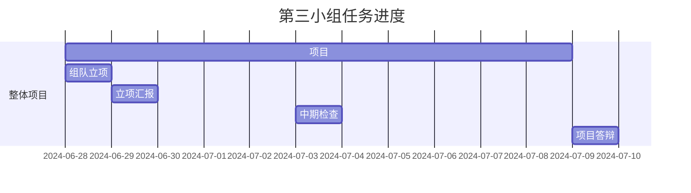
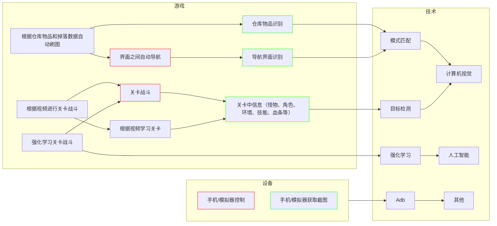

# AahAI
## 时间节点

```mermaid
gantt
    title 第三小组任务进度
    dateFormat  YYYY-MM-DD
    section 整体项目
    项目											  :2024-06-28, 2024-07-09
    组队立项           								 :a1, 2024-06-28, 1d
    立项汇报           								 :a2, 2024-06-29, 1d
    中期检查                                         :a3, 2024-07-03, 1d
    项目答辩           								 :a4, 2024-07-09, 1d
```

## 概述

可以实现的东西及相关技术：

```mermaid
flowchart LR
classDef control stroke:#f00
classDef screenshot stroke:#0f0
subgraph 设备
    control[手机/模拟器控制]:::control
    screenshot[手机/模拟器获取截图]:::screenshot
end
设备 --> Adb

subgraph 技术
    模式匹配 --> 计算机视觉
    目标检测 --> 计算机视觉
    强化学习 --> 人工智能
    Adb --> 其他
end

subgraph 游戏
    仓库物品识别:::screenshot --> 模式匹配
    导航界面识别:::screenshot --> 模式匹配
    
    界面之间自动导航:::control --> 导航界面识别
    
    根据仓库物品和掉落数据自动刷图 --> 仓库物品识别
    根据仓库物品和掉落数据自动刷图 --> 界面之间自动导航
    
    关卡战斗:::control --> info
    根据视频学习关卡 --> info
    根据视频进行关卡战斗 --> 关卡战斗
    根据视频进行关卡战斗 --> 根据视频学习关卡
    强化学习关卡战斗 --> 关卡战斗
    强化学习关卡战斗 --> 强化学习
    
    info[关卡中信息（怪物、角色、环境、技能、血条等）]:::screenshot --> 目标检测
end
```
